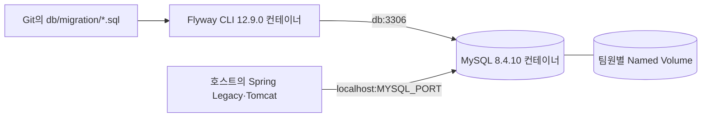

# 현재 빌드 기준 Docker Compose·Flyway DB 가이드

> 적용 기준: 2026-07-20의 실제 Gradle 빌드와 `docs/DEPENDENCY_SPECIFICATION.md`의 DB 인프라 기준
>
> 한 줄 원칙: **MySQL 실행 환경은 Docker Compose로 고정하고, 스키마 변경은 WAR가 아닌 Flyway CLI 컨테이너가 적용합니다.**

이 가이드는 팀원별 로컬 개발 DB를 같은 조건으로 재현하는 방법을 설명합니다. Vue 개발 서버와 Spring Legacy WAR·Tomcat은 현재 Docker에 넣지 않으며, Docker Compose는 MySQL과 Flyway에만 사용합니다.

## 1. 현재 구현 상태

현재 저장소는 DB 관련 라이브러리의 버전만 확정된 상태이며 아직 DB 연결이 완성되지 않았습니다.

| 항목 | 현재 상태 |
| --- | --- |
| `backend/build.gradle` | MyBatis·MyBatis-Spring·HikariCP·Connector/J 의존성 선언 완료 |
| 루트 `compose.yaml` | 빈 자리표시자 파일이며 아직 실행 가능한 서비스 정의 없음 |
| 루트 `.env.example` | 아직 없음 |
| `backend/src/main/resources/db/migration/` | `.gitkeep`만 있고 실제 Migration 없음 |
| Spring DB 설정 | `DataSource`, `SqlSessionFactory`, Transaction Bean과 환경변수 연결 미구현 |

따라서 아래 Compose 내용과 명령은 **다음 DB 구성 작업에서 만들어야 할 기준안**입니다. 현재 빈 `compose.yaml` 상태에서는 `docker compose up`을 실행하지 않습니다.

## 2. 현재 빌드와 DB 구성의 관계

| 구성 요소 | 고정 버전 | 위치와 역할 |
| --- | --- | --- |
| Java | `17` | Spring Legacy 애플리케이션 실행 |
| Gradle Wrapper | `9.3.0` | 백엔드 의존성 해석·검증·WAR 빌드 |
| Spring Framework | `5.3.39` | JDBC·Transaction 관리 |
| Tomcat | `9.0.118` | 외부 Servlet Container, WAR 배포 |
| MyBatis | `3.5.19` | Mapper XML의 SQL 실행 |
| MyBatis-Spring | `2.1.2` | Spring 5와 MyBatis 연동 |
| HikariCP | `7.0.2` | 애플리케이션 JDBC Connection Pool |
| MySQL Connector/J | `9.7.0` | WAR의 MySQL JDBC Driver, `runtimeOnly` |
| MySQL Server | `8.4.10` LTS | `mysql:8.4.10` 컨테이너 |
| Flyway CLI | `12.9.0` | `flyway/flyway:12.9.0` 컨테이너에서 Migration 실행 |

Connector/J와 Flyway의 역할을 섞지 않습니다.

- Spring 애플리케이션은 Connector/J `9.7.0`과 HikariCP를 통해 MySQL에 연결합니다.
- Flyway CLI 컨테이너는 자신의 실행 환경으로 Migration을 적용합니다.
- Flyway Java·Gradle Plugin을 `backend/build.gradle`에 추가하거나 WAR에 포함하지 않습니다.
- 애플리케이션 시작 시 DDL을 실행하지 않고 MyBatis Mapper XML에도 DDL을 넣지 않습니다.



`db`라는 호스트명은 Compose 내부 네트워크에서만 사용합니다. IntelliJ나 로컬 Tomcat에서 실행한 Spring 애플리케이션은 `localhost`와 `.env`의 `MYSQL_PORT`로 접속합니다.

## 3. Git으로 공유하는 것과 공유하지 않는 것

| 항목 | 역할 | Git 커밋 |
| --- | --- | --- |
| `compose.yaml` | MySQL·Flyway 이미지와 공통 실행 설정 | O |
| 루트 `.env.example` | 필요한 DB 환경변수 이름과 개발용 예시 | O |
| 루트 `.env` | 개인 포트와 로컬 비밀번호 | X |
| `backend/src/main/resources/db/migration/*.sql` | 스키마 변경 이력 | O |
| Docker Named Volume | 팀원별 로컬 DB 데이터 | X |
| DB Dump·실제 개인정보 | 공유 대상 아님 | X |

프론트엔드의 `frontend/.env.example`은 API 주소용이며 루트 DB 환경설정과 별개입니다. DB 전체 Dump나 Workbench에서 수행한 수동 DDL은 팀의 스키마 원본으로 인정하지 않습니다.

## 4. 목표 파일 구조

```text
<repository-root>/
  compose.yaml
  .env.example
  backend/
    build.gradle
    src/main/resources/
      db/migration/
        V202607201300__create_users.sql
      mappers/
```

### 4.1 목표 `compose.yaml`

다음 구성은 현재 고정 종속성에 맞춘 로컬 개발용 기준안입니다. MySQL 포트는 외부 네트워크가 아니라 각 PC의 `127.0.0.1`에만 공개합니다.

```yaml
services:
  db:
    image: mysql:8.4.10
    ports:
      - "127.0.0.1:${MYSQL_PORT:-3306}:3306"
    environment:
      MYSQL_ROOT_PASSWORD: ${MYSQL_ROOT_PASSWORD}
      MYSQL_DATABASE: ${MYSQL_DATABASE}
      MYSQL_USER: ${MYSQL_USER}
      MYSQL_PASSWORD: ${MYSQL_PASSWORD}
      TZ: Asia/Seoul
    command:
      - --character-set-server=utf8mb4
      - --collation-server=utf8mb4_0900_ai_ci
      - --default-time-zone=+09:00
    volumes:
      - mysql-data:/var/lib/mysql
    healthcheck:
      test: ["CMD-SHELL", "mysqladmin ping -h localhost -u root -p\"$${MYSQL_ROOT_PASSWORD}\" --silent"]
      interval: 5s
      timeout: 5s
      retries: 10
      start_period: 20s

  flyway:
    image: flyway/flyway:12.9.0
    profiles: ["tools"]
    environment:
      FLYWAY_URL: jdbc:mysql://db:3306/${MYSQL_DATABASE}
      FLYWAY_USER: ${MYSQL_USER}
      FLYWAY_PASSWORD: ${MYSQL_PASSWORD}
      FLYWAY_LOCATIONS: filesystem:/flyway/sql
      FLYWAY_CONNECT_RETRIES: "30"
      FLYWAY_VALIDATE_MIGRATION_NAMING: "true"
      FLYWAY_CLEAN_DISABLED: "true"
    volumes:
      - ./backend/src/main/resources/db/migration:/flyway/sql:ro
    depends_on:
      db:
        condition: service_healthy

volumes:
  mysql-data:
```

Flyway는 `tools` Profile로 분리하므로 DB를 시작할 때 상시 실행되지 않습니다. 필요한 시점에 `migrate`, `info`, `validate` 명령을 명시적으로 실행합니다.

### 4.2 목표 루트 `.env.example`

```dotenv
MYSQL_PORT=3306
MYSQL_DATABASE=kb_pjt
MYSQL_USER=kb_pjt_app
MYSQL_PASSWORD=change-me-local
MYSQL_ROOT_PASSWORD=change-me-root
```

위 값은 로컬 개발용 예시일 뿐 실제 비밀번호가 아닙니다. 각 팀원은 `.env.example`을 `.env`로 복사한 뒤 개인 값을 사용하고 `.env`는 커밋하지 않습니다.

로컬에서는 학습과 실행 단순화를 위해 `MYSQL_USER`가 애플리케이션과 Migration에 함께 사용될 수 있습니다. 공용 통합·시연 환경을 만들 때는 런타임 계정과 DDL 권한을 가진 Migration 계정을 분리합니다.

### 4.3 첫 Migration 예시

파일명은 `V연월일시분__영문_설명.sql` 형식을 사용합니다. 같은 분에 두 파일을 만들지 않고 설명의 공백은 `_`로 씁니다.

```sql
-- backend/src/main/resources/db/migration/V202607201300__create_users.sql
CREATE TABLE users (
    user_id BIGINT NOT NULL AUTO_INCREMENT,
    email VARCHAR(255) NOT NULL,
    created_at TIMESTAMP(6) NOT NULL DEFAULT CURRENT_TIMESTAMP(6),
    PRIMARY KEY (user_id),
    UNIQUE KEY uk_users_email (email)
) ENGINE=InnoDB DEFAULT CHARSET=utf8mb4 COLLATE=utf8mb4_0900_ai_ci;
```

이 SQL은 형식 설명용이므로 그대로 커밋하지 않습니다. 첫 실제 Migration은 확정된 ERD의 테이블·제약·인덱스를 기준으로 작성합니다.

`/docker-entrypoint-initdb.d`는 지속적인 스키마 관리에 사용하지 않습니다. 해당 디렉터리는 빈 MySQL 데이터 디렉터리의 최초 실행에만 동작하므로 기존 Named Volume에 후속 변경을 적용할 수 없습니다.

## 5. 구성 구현 후 최초 실행

프로젝트 루트에서 Docker Desktop 실행을 먼저 확인합니다.

```powershell
docker --version
docker compose version
Copy-Item .env.example .env
```

이미 `.env`가 있다면 다시 복사하지 않습니다. 이어서 Compose 구문, 이미지, DB 상태를 확인하고 Migration을 적용합니다.

```powershell
docker compose config --quiet
docker compose --profile tools pull db flyway
docker compose up -d db
docker compose ps
docker compose --profile tools run --rm flyway migrate
docker compose --profile tools run --rm flyway info
docker compose --profile tools run --rm flyway validate
```

`migrate`와 `validate`가 성공하고 `info`에 Migration이 `Success`로 표시되어야 합니다.

### 접속 주소 구분

| 접속 주체 | JDBC 또는 접속 주소 |
| --- | --- |
| Flyway 컨테이너 | `jdbc:mysql://db:3306/kb_pjt` |
| 호스트의 Spring·Tomcat | `jdbc:mysql://localhost:3306/kb_pjt` |
| Workbench 같은 로컬 DB Client | `localhost:3306` |

포트가 충돌해 `MYSQL_PORT=3307`로 바꿨다면 호스트의 Spring·Tomcat과 DB Client도 `3307`을 사용합니다. Flyway 컨테이너는 계속 `db:3306`을 사용합니다.

Compose가 읽는 루트 `.env`의 값은 IntelliJ나 외부 Tomcat에 자동으로 전달되지 않습니다. HikariCP 설정 작업에서 동일한 접속 값을 애플리케이션 환경변수 또는 Git 제외 설정으로 별도 연결해야 합니다.

## 6. Spring Legacy 연결 시 추가할 구성

현재 Gradle 의존성은 준비되어 있지만 다음 Bean과 설정은 아직 없습니다.

1. 환경별 JDBC URL·사용자·비밀번호를 읽는 설정
2. HikariCP 기반 `DataSource`
3. MyBatis `SqlSessionFactory`와 Mapper XML 위치
4. Mapper Interface 검색 설정
5. Spring `DataSourceTransactionManager`
6. 실제 MySQL을 사용하는 최소 Repository·Transaction 통합 테스트

이 구성이 추가되기 전에는 Gradle `check`가 통과해도 실제 DB 연결이 검증된 것은 아닙니다. Flyway 의존성을 WAR에 추가해서 이 공백을 해결하지 않습니다. DB 연결과 Schema Migration은 각각 애플리케이션 설정과 Flyway CLI 컨테이너의 책임입니다.

## 7. 스키마 변경 공유 절차

예를 들어 `users`에 `nickname`을 추가한다면 기존 Migration을 수정하지 않고 새 파일을 만듭니다.

```sql
-- V202607201430__add_nickname_to_users.sql
ALTER TABLE users
    ADD COLUMN nickname VARCHAR(50) NULL AFTER email;
```

표준 순서는 다음과 같습니다.

1. 최신 코드와 Migration을 받습니다.
2. 새 Versioned Migration SQL을 추가합니다.
3. 개인 Docker DB에 `migrate`를 실행합니다.
4. `info`와 `validate`로 버전·체크섬을 확인합니다.
5. 관련 MyBatis Mapper XML과 DTO 영향을 함께 확인합니다.
6. Migration SQL과 검증 결과를 PR에 포함합니다.
7. 다른 팀원은 머지된 코드를 받은 뒤 자신의 DB에 `migrate`를 실행합니다.

한 번 적용했거나 Git에 공유한 Versioned Migration은 수정·삭제하지 않습니다. 오류는 더 높은 버전의 새 SQL로 보정합니다. 개발 Seed는 Schema Migration과 분리하고 실제 개인정보나 운영 Dump를 저장소에 넣지 않습니다.

## 8. 공용 통합 DB 적용 규칙

개인 개발은 팀원별 Docker MySQL에서 진행하고 공용 통합 DB는 머지 결과 검증에만 사용합니다.

- `main`에 머지된 Migration만 지정된 담당자나 CI가 적용합니다.
- 수동 `ALTER`, `DROP`, `Flyway clean`을 금지합니다.
- 애플리케이션 계정과 Migration 계정을 분리합니다.
- MySQL 포트 `3306`을 인터넷 전체에 공개하지 않습니다.
- 합성 Seed만 사용하고 초기화·백업·복구 담당자를 정합니다.

## 9. 자주 쓰는 명령

| 목적 | 명령 |
| --- | --- |
| 설정 검증 | `docker compose config --quiet` |
| DB 시작 | `docker compose up -d db` |
| 상태 확인 | `docker compose ps` |
| DB 로그 확인 | `docker compose logs db` |
| 새 Migration 적용 | `docker compose --profile tools run --rm flyway migrate` |
| 적용 이력 확인 | `docker compose --profile tools run --rm flyway info` |
| Migration 검증 | `docker compose --profile tools run --rm flyway validate` |
| DB 중지 | `docker compose down` |
| 로컬 DB 완전 초기화 | `docker compose down -v` |

`docker compose down`은 컨테이너와 네트워크만 정리하고 Named Volume의 데이터는 유지합니다. `docker compose down -v`는 Named Volume과 로컬 DB 데이터를 모두 삭제하므로 정말 처음부터 재현할 때만 사용합니다. `FLYWAY_CLEAN_DISABLED=true`이므로 Flyway `clean`으로 초기화하지 않습니다.

## 10. 문제 해결

- **`no configuration file provided` 또는 빈 Compose 오류:** 현재 자리표시자 `compose.yaml`에 4.1의 서비스 구성이 아직 구현되지 않은 상태입니다.
- **포트가 이미 사용 중임:** `.env`의 `MYSQL_PORT`를 `3307`처럼 바꾸고 호스트 애플리케이션의 JDBC 포트도 같이 변경합니다.
- **Flyway는 연결되는데 Spring은 연결되지 않음:** Flyway의 `db:3306`과 호스트 Spring의 `localhost:MYSQL_PORT`를 혼동하지 않았는지 확인합니다.
- **`.env`를 바꿨는데 DB 계정이 그대로임:** MySQL 초기 환경변수는 빈 데이터 볼륨에만 적용됩니다. 로컬 데이터를 지워도 될 때만 `docker compose down -v` 후 다시 실행합니다.
- **Checksum 오류:** 이미 적용한 Migration이 수정된 것입니다. 기존 파일을 원래대로 되돌리고 새 Migration을 추가합니다.
- **팀원 DB에서만 실패:** Workbench 등으로 수동 생성한 테이블·컬럼이 없는지 확인하고 필요한 변경을 새 Migration에 넣습니다.
- **Gradle 테스트는 통과하지만 DB 기능이 실패:** 현재 DB 통합 Bean·테스트가 아직 구현되지 않았는지 확인합니다.

## 11. PR 체크리스트

- [ ] MySQL `8.4.10`, Flyway CLI `12.9.0`, Connector/J `9.7.0` 기준을 유지했는가?
- [ ] Migration 파일명이 `V연월일시분__영문_설명.sql` 형식인가?
- [ ] 이미 적용되거나 공유된 Migration을 수정하지 않았는가?
- [ ] `migrate`, `info`, `validate`가 성공했는가?
- [ ] 새 빈 Volume에서도 전체 Migration을 재현할 수 있는가?
- [ ] 변경한 테이블과 관련된 MyBatis Mapper·DTO·Transaction을 확인했는가?
- [ ] `.env`, 실제 개인정보, 운영 데이터 Dump가 포함되지 않았는가?
- [ ] 공용 통합 DB에 미병합 Migration이나 수동 DDL을 적용하지 않았는가?

## 참고 자료

- [Docker Compose 시작 가이드](https://docs.docker.com/compose/gettingstarted/)
- [Docker Compose Volume](https://docs.docker.com/reference/compose-file/volumes/)
- [MySQL 공식 Docker 이미지](https://hub.docker.com/_/mysql)
- [MySQL Connector/J 버전 호환성](https://dev.mysql.com/doc/connector-j/en/connector-j-versions.html)
- [Flyway Docker](https://documentation.red-gate.com/flyway/reference/usage/flyway-docker)
- [Flyway 환경변수](https://documentation.red-gate.com/flyway/reference/configuration/environment-variables)
- [Flyway Versioned Migration](https://documentation.red-gate.com/flyway/flyway-concepts/migrations/versioned-migrations)
- [Flyway Validate](https://documentation.red-gate.com/flyway/reference/commands/validate)
- [MyBatis-Spring](https://mybatis.org/spring/)
