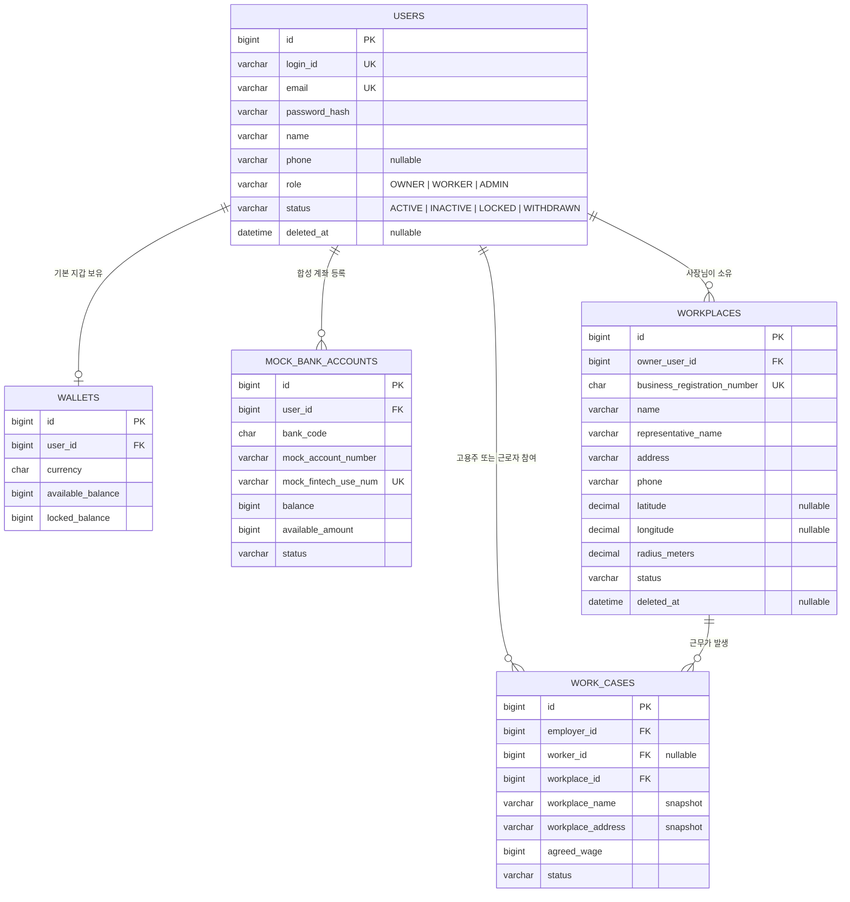

# 회원가입·사업장 데이터베이스 스키마

## 목적과 범위

이 문서는 이슈 #17의 회원가입 화면과 API 명세를 기준으로 회원, Mock 계좌, 사장님의 복수 사업장과 근무 건 연결에 필요한 MySQL 스키마를 정의합니다. 적용 Migration은 `backend/src/main/resources/db/migration/V202607211440__add_signup_and_workplace_schema.sql`입니다.

이번 범위는 회원가입과 가입 직후 사용할 사업장·Mock 계좌 데이터까지입니다. 알림, 문서 공유 등 API 명세의 나머지 기능은 각 기능 이슈에서 별도로 검토합니다.

## 화면·API·DB 대응

| 화면 또는 API 입력 | 저장 위치 | 규칙 |
| --- | --- | --- |
| 아이디 `loginId` | `users.login_id` | 필수, 대소문자를 구분하지 않는 고유값 |
| 비밀번호 `password` | `users.password_hash` | 원문을 저장하지 않고 단방향 해시만 저장 |
| 비밀번호 확인 `passwordConfirm` | 저장하지 않음 | 요청 검증 후 즉시 폐기 |
| 이름 `name` | `users.name` | 필수 |
| 이메일 `email` | `users.email` | 필수, 고유값 |
| 전화번호 `phone` | `users.phone` | API 명세대로 선택값 |
| 가입 유형 `role` | `users.role` | `OWNER`, `WORKER`; `ADMIN`은 공개 가입 금지 |
| 은행 선택 | `mock_bank_accounts.bank_code` | 3자리 합성 은행 코드 |
| 간편 계좌 | `mock_bank_accounts.mock_account_number` | 합성 계좌 식별자만 허용 |
| 사업자등록번호 | `workplaces.business_registration_number` | 하이픈 제거 후 숫자 10자리, 전체 고유값 |
| 상호명 | `workplaces.name` | 필수 |
| 대표자명 | `workplaces.representative_name` | 회원 이름과 다를 수 있어 사업장별 저장 |
| 사업장 주소 | `workplaces.address` | 필수 |
| 사업장 전화번호 | `workplaces.phone` | 필수 |
| GPS 좌표·허용 반경 | `workplaces.latitude`, `longitude`, `radius_meters` | 좌표는 둘 다 있거나 둘 다 없어야 하며 기본 반경은 100m |

`users.status`에는 탈퇴를 표현하는 `WITHDRAWN`과 `deleted_at`을 추가했습니다. 아이디와 이메일 고유값은 탈퇴 후에도 재사용하지 않아 과거 근무·정산 감사 관계가 다른 사람에게 연결되지 않게 합니다.

## 정규화 결정

- 한 사장님은 사업장을 여러 개 등록할 수 있으므로 `users`와 `workplaces`는 1:N입니다.
- 사업자등록번호, 상호명, 대표자명, 주소와 사업장 전화번호는 `employer_profiles`가 아니라 `workplaces`를 기준 정보로 사용합니다. 기존 `employer_profiles`의 단일 사업장 필드는 호환을 위해 남아 있지만 신규 구현에서는 읽거나 쓰지 않습니다.
- `work_cases`는 `workplace_id`를 필수로 저장합니다. `(employer_id, workplace_id)` 복합 외래키가 해당 사업장이 실제로 그 사장님 소유인지 DB에서도 검증합니다.
- 근무 당시 상호명·주소·좌표는 계약 이력 보존을 위해 기존 `work_cases`와 `work_contracts` 스냅샷에도 계속 저장합니다. 사업장 기준 정보가 수정되어도 확정된 근무 조건은 바뀌지 않습니다.
- 개발·시연 환경의 계좌는 `MockBankAdapter`용 합성 값만 사용합니다. 실제 은행 계좌번호나 핀테크이용번호는 입력하거나 저장하지 않습니다.

## 회원가입 트랜잭션 경계

화면의 모든 필드를 한 번에 제출하는 방식이라면 Service의 단일 트랜잭션에서 다음 순서로 처리합니다.

1. 아이디와 이메일 중복을 확인하고 `users`를 생성합니다.
2. `wallets`를 생성합니다.
3. 합성 은행 코드와 합성 계좌 식별자가 전달되면 `mock_bank_accounts`를 생성합니다.
4. 역할이 `OWNER`이면 하나 이상의 `workplaces`를 생성합니다.
5. 어느 단계든 실패하면 전체 가입을 롤백합니다.

## Mermaid ERD

## API 명세에서 보완할 점

현재 `POST /api/auth/signup` 명세에는 공통 회원 필드만 있고 화면의 은행·계좌와 사장님 사업장 배열이 없습니다. 구현 전에 다음 두 방식 중 하나를 API 명세로 확정해야 합니다.

- 화면 전체를 한 번에 저장하려면 가입 요청에 `bankAccount`와 `OWNER` 전용 `workplaces[]`를 추가하고 위 트랜잭션 경계를 적용합니다.
- 가입과 등록을 분리하려면 회원가입 성공 후 Mock 계좌 등록 API와 확장된 `POST /api/workplaces`를 순서대로 호출합니다. 이 경우 중간 이탈 상태와 재시도 UX를 별도로 정의해야 합니다.

또한 현재 `POST /api/workplaces`는 `name`, `address`, 좌표와 반경만 받습니다. 사업자등록번호, 대표자명과 사업장 전화번호를 요청 필드에 추가해야 화면과 DB가 일치합니다.

## 검증 및 보안 기준

- Flyway는 기존 기준 Migration을 수정하지 않고 새 Versioned Migration으로 적용합니다.
- 빈 MySQL 8.4 스키마에서 전체 `migrate`, `validate`와 23개 도메인 테이블·46개 외래키를 확인합니다.
- `OWNER`가 다른 사장님의 사업장으로 근무 건을 만들 수 없는지 복합 외래키 실패로 확인합니다.
- 실제 개인정보와 실제 계좌정보를 Seed, 테스트, 로그와 Git에 넣지 않습니다.
